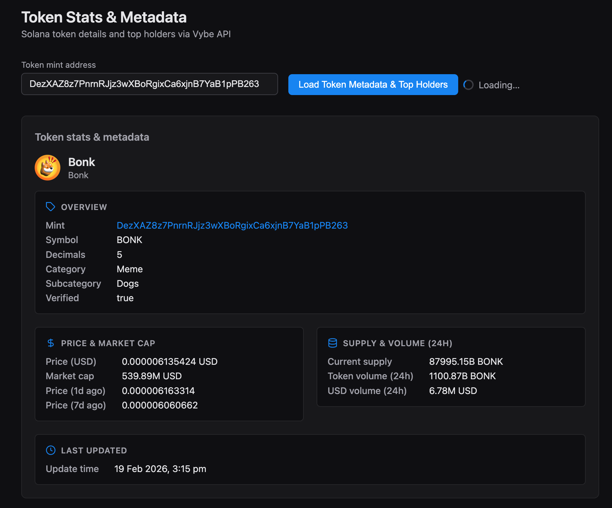
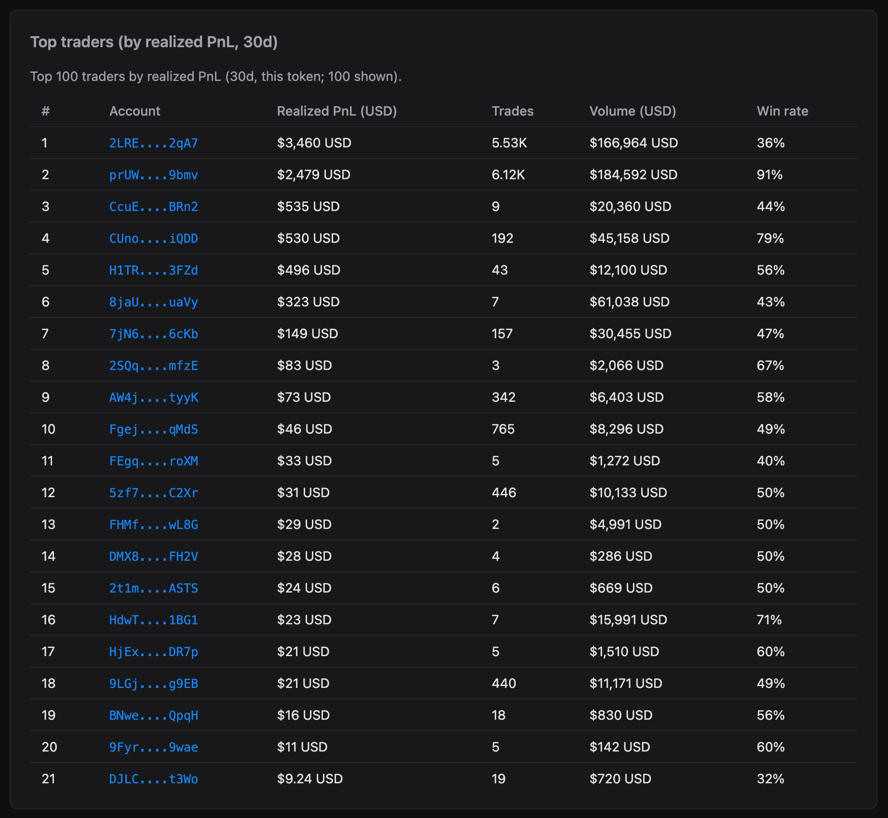
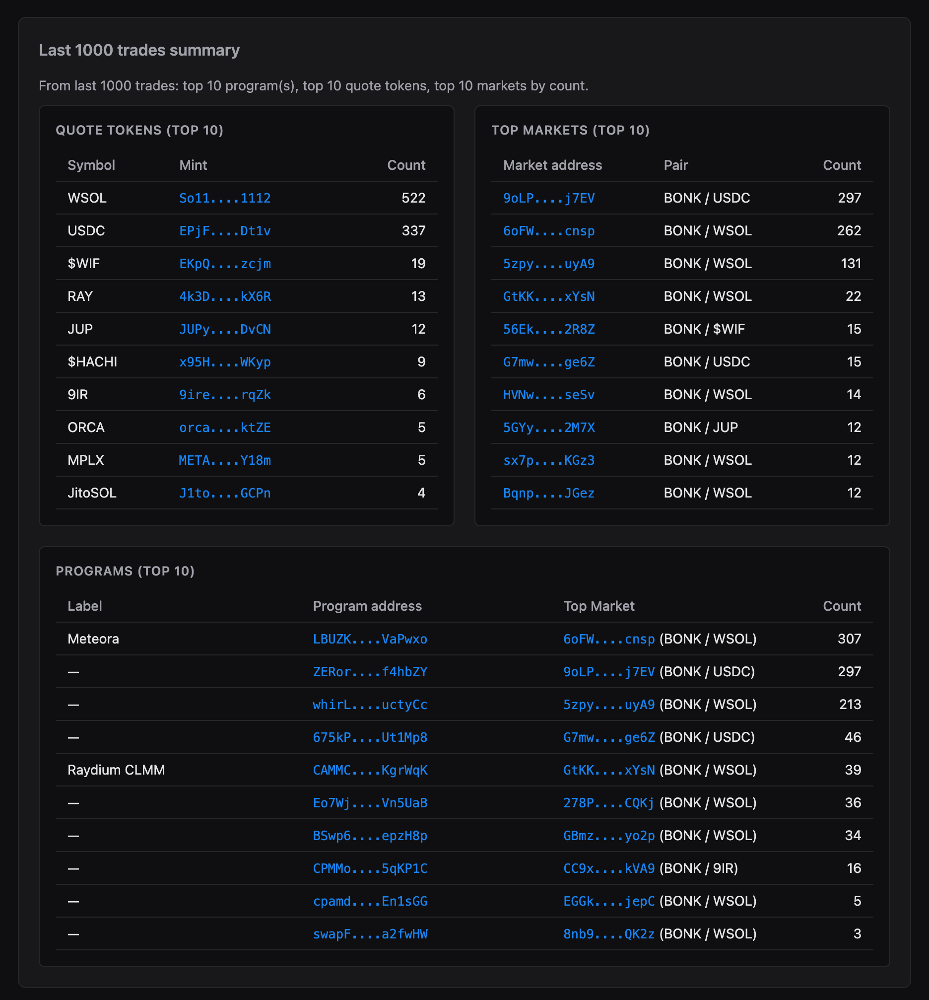

# Solana Token Stats & Metadata API

This repository demonstrates how to use the Vybe Solana Token API to fetch token stats and metadata for any SPL token.



<p align="center">
  
  
  
</p>

## Prerequisites

- **Node.js** ≥ 20 (LTS recommended; see [.nvmrc](.nvmrc) for exact version)
- **npm** ≥ 10 (or equivalent)

## Quick Start

Get from clone to running app in four commands:

```bash
git clone https://github.com/vybenetwork/solana-token-stats-metadata-api.git
cd solana-token-stats-metadata-api
npm install
cp .env.example .env
# Edit .env and set VYBE_API_KEY=your_api_key_here
npm start
```

Then open **http://localhost:3000**, enter a token mint, and click **Load Token Metadata & Top Holders**.

## Environment Variables

| Variable | Required | Description | Example |
|----------|----------|-------------|---------|
| `VYBE_API_KEY` | Yes | Vybe API key for all Vybe requests | `your_api_key_here` |
| `SOLANA_RPC_URL` | No | RPC for Metaplex symbol lookup (token-symbol fallback) | `https://api.mainnet-beta.solana.com` |
| `PORT` | No | Server port | `3000` |
| `TUNNEL` | No | Set to `1` to run with Cloudflare Tunnel | `1` |

Get your API key at [vybenetwork.com/pricing](https://vybenetwork.com/pricing).

---

**Retrieve:**

- Token price
- Market cap
- 24h volume
- Holder count
- Symbol, name, decimals
- Top holders (top 100; updated every 3 hours)
- Most recent 1000 trades
  - Pair (base/quote)
  - Markets by activity
  - Programs by activity
  - Pools by activity
  - Quote tokens by activity
  - Trade counts
- Top traders (top 100 by realized PnL, 30d; filtered by mint)

Data is sourced from Pump.fun, Raydium, Orca, and 30+ other Solana DEX programs using vetted market data. When metadata is available from both Pump.fun and PumpSwap, PumpSwap is preferred.

This repo includes:

- Token details (stats and metadata) endpoint
- Top holders endpoint
- Top traders endpoint (by realized PnL, 30d)
- Trades endpoint (most recent 1000 trades)
- A browser-based web app (GUI) to browse token stats, most recent 1000 trades, top traders (filtered by mint), and top holders in one view (mint, quote mint, program address, market address, and owner addresses link to Solscan in a new tab; links use a consistent blue style)

## Why This Matters

Token stats and metadata are foundational for:

- Token research
- Analytics dashboards
- Trading tools
- Token monitors / token trackers

A Solana token API that aggregates data from Pump.fun, Raydium, and other vetted markets provides consistent token price, volume, and market cap data.

Vybe’s `/v4/tokens/{mintAddress}` endpoint returns token details and metrics; `/v4/tokens/{mintAddress}/top-holders` returns the top 100 holders sorted by highest percentage of supply (updated every 3 hours). When both Pump.fun and PumpSwap return results for metadata, use PumpSwap’s.

This demo uses:

- **Token details / metrics endpoint** — price, market cap, volume, metadata
- **Top holders endpoint** — top token holders (rank, balance, value USD, % supply)
- **Top traders endpoint** — top 100 wallets by realized PnL (30d) for the token
- **Trades endpoint** — last 1000 trades to build programs, quote tokens, and markets summary
- **Labeled program endpoint** — per-address Vybe lookup for top-10 program labels (well-known map first, then queued requests)

## What You Get

<<<<<<< HEAD
**[Get your free Vybe API key →](https://vybenetwork.com/pricing?utm_source=github&utm_medium=repo&utm_campaign=solana-historical-trade-data-api)**  
**[Vybe API documentation →](https://docs.vybenetwork.com/reference/get_trade_data_program_v4?utm_source=github&utm_medium=repo&utm_campaign=solana-historical-trade-data-api)**
=======
### Token Stats & Metadata
>>>>>>> 57b2ff0 (Update README and lockfile on main)

Retrieve:

- Price
- Market cap
- 24h volume
- Holder count
- Symbol
- Name
- Decimals
- Current supply
- Price change metrics (e.g. 1d, 7d where available)

For any SPL token mint.

### Top markets (from last 1000 trades)

- Uses the last 1000 trades and counts by `marketAddress` to show the top 10 markets.
- For each market, the **Pair** column shows base token / most common quote mint (excluding the token mint).
- Table columns: Market address, Pair, Count.
- Market addresses link to Solscan in a new tab.


### Top Traders (30d)

- Fetches **top traders** via `GET /v4/wallets/top-traders` with `mintAddress`, `resolution=30d`, `sortByDesc=realizedPnlUsd`, `limit=100` (server proxy: `GET /api/wallets/top-traders?…`).
- The endpoint is filtered by `mintAddress`.
- Table columns: #, Account, Realized PnL (USD), Trades, Volume (USD), Win rate.
- Realized PnL and Volume (USD) are shown as full amounts with a leading `$` and trailing ` USD`; no decimals unless value is less than 10 (then up to 2 decimals).
- Win rate is shown as value then `%` (e.g. `42%`); 2 decimals only when value is less than 1.
- Account addresses link to Solscan in a new tab.


### Top Holders

- Fetches **top holders** via `GET /v4/tokens/{mintAddress}/top-holders` (`page=0`, `limit=100`, `sortByDesc=percentageOfSupplyHeld`).
- Table columns: rank, owner, balance, value (USD), and % of supply.
- Shows top 100 by highest % of supply (updated every 3 hours).
- Owner addresses link to Solscan in a new tab.


### Fetch sequence (web app)

- **Behavior**
  - Requests run in stages with a 2s delay between stages.
  - Each section has its own loading indicator next to the title.
  - If one section fails, the others keep loading.
  - Failed sections show `Failed (code X)` / `Failed (status)`.

- **Request order**
  1. **Token details**
     - Endpoint: `GET /v4/tokens/{mintAddress}`
     - If this fails, fallback to `GET /api/token-symbol/:mint` (Metaplex) to still show symbol + mint.
  2. **Most recent 1000 trades**
     - Endpoint: `GET /v4/trades` (server: `GET /api/trades?mintAddress=…&limit=1000&page=0&sortByDesc=blockTime`)
     - Used to build top programs, top quote tokens, and top markets.
  3. **Program labels (top 10 programs)**
     - For each of the top 10 programs that does not already have a label in the well-known map (Raydium, Orca, Pump.fun, Meteora, Phoenix, Jupiter, etc.), the app calls `GET /api/programs/labeled-program-account?programAddress=…` (one request per address, queued with concurrency 2). The Vybe API used is `GET /v4/programs/labeled-program-accounts?programAddress=…`.
  4. **Quote symbols**
     - Source priority:
       - Hardcoded: WSOL, USDC
       - Fallback: `GET /api/token-symbol/:mint`
     - Continues in batches until 10 displayable quote symbols are found (or exhausted).
  5. **Top traders + top holders** (parallel)
     - Top traders:
       - Endpoint: `GET /v4/wallets/top-traders`
       - Params: `mintAddress`, `resolution=30d`, `sortByDesc=realizedPnlUsd`, `limit=100`
       - Proxy: `GET /api/wallets/top-traders?…`
     - Top holders:
       - Endpoint: `GET /v4/tokens/{mintAddress}/top-holders`
       - Params: `page=0`, `limit=100`, `sortByDesc=percentageOfSupplyHeld`

### Last 1000 trades: fetch and top 10 extraction

- **Fetch**
  - Endpoint: `GET /v4/trades`
  - Params: `mintAddress`, `limit=1000`, `sortByDesc=blockTime`
  - Server proxy: `GET /api/trades?mintAddress=…&…`

- **Top 10 programs**
  - Aggregate by `programAddress`.
  - Sort by trade count descending.
  - Keep top 10 programs.
  - Label source:
    - Well-known DEX map first (Raydium, Orca, Pump.fun, Meteora, Phoenix, Jupiter, etc.).
    - For any program without a label: `GET /api/programs/labeled-program-account?programAddress=…` (queued, one Vybe request per address).
  - For each program:
    - Compute top market by trade count.
    - Compute pair as base token / most common quote mint in that market.
  - Rows with no resolvable top market (e.g. unresolved pool or scam token) are omitted from the table.
  - Program and market addresses link to Solscan.

- **Top 10 quote tokens**
  - Aggregate by `quoteMintAddress`.
  - Sort by trade count descending.
  - Keep top 10 with displayable symbols.
  - Symbol source:
    - Hardcoded WSOL/USDC
    - `GET /api/token-symbol/:mint` fallback
  - Table columns:
    - Symbol
    - Mint
    - Count

- **Top 10 markets**
  - Aggregate by `marketAddress`.
  - Sort by trade count descending.
  - Keep top 10 markets.
  - Pair logic:
    - Base token / most common quote mint
    - Excludes the base mint from quote side
  - Table columns:
    - Market address
    - Pair
    - Count

### Single REST API

Use one Solana token API to retrieve:

- Token price
- Metadata
- Top holders

### Web App (GUI)

The included web app allows you to:

- Enter a token mint
- Click **Load Token Metadata & Top Holders** to load data: the app fetches token details (with Metaplex symbol fallback if Vybe token API fails), then last 1000 trades (and builds the programs, quote-token, and markets summary), then top traders and top holders in parallel (with 2s delays between stages)
- See per-section loading (spinner + “Loading…” next to each section title) until that section’s data is loaded; if a section fails, a red “Failed (code X)” or “Failed (status)” appears next to the title and other sections still load
- View token stats (price, market cap, volume 24h, holders) and metadata (symbol, name, decimals); Overview shows the full mint address (linked to Solscan)
- View **Last 1000 trades summary**: top 10 quote tokens and top 10 markets on the first row, then **Programs (top 10)** on its own row with Label, Program address, Top Market (market + pair), and Count
- View **Top traders (by realized PnL, 30d)**: #, Account, Realized PnL (USD), Trades, Volume (USD), Win rate
- View top 100 holders (owner addresses open Solscan in a new tab)

When metadata is available from both Pump.fun and PumpSwap, PumpSwap’s result is preferred. All data is fetched from the Vybe Solana Token API (and Metaplex for symbol fallback when token details fail).

## Get a Free API Key

You’ll need a Vybe API key to run this demo.

- [Get your free Vybe API key](https://vybenetwork.com/pricing?utm_source=github&utm_medium=repo&utm_campaign=solana-token-stats-metadata-api)
- [View Vybe API documentation](https://docs.vybenetwork.com/docs/token-details-spl-token-2022?utm_source=github&utm_medium=repo&utm_campaign=solana-token-stats-metadata-api)

## Project Structure

```
solana-token-stats-metadata-api/
├── .env.example       # Copy to .env, fill in VYBE_API_KEY
├── .nvmrc             # Node version (22)
├── tsconfig.json      # TypeScript strict mode
├── package.json       # Pinned exact versions (no ^ or ~)
├── README.md
├── screenshots/       # Screenshots for README
├── public/            # Web GUI (HTML, CSS); app.js is built from TypeScript
│   ├── index.html
│   ├── app.js         # Generated by `npm run build:frontend` (from src/frontend/app.ts)
│   └── app.css
├── tsconfig.frontend.json   # Frontend TS → public/app.js
└── src/
    ├── server.ts      # Entry point — Express server, proxies Vybe API, serves public/
    ├── config.ts      # Env loading, API base URL, timeouts
    ├── types/
    │   └── api.ts     # Interfaces matching Vybe API response shapes
    ├── api/
    │   ├── index.ts   # createClient(apiKey) — wires all API methods
    │   ├── client.ts  # Axios wrapper, retries, human-readable errors
    │   ├── tokens.ts  # GET /v4/tokens/{mint}
    │   ├── holders.ts # GET /v4/tokens/{mint}/top-holders
    │   ├── trades.ts  # GET /v4/trades, /v4/programs/labeled-program-accounts, /v4/wallets/top-traders
    │   └── token-symbol.ts  # Metaplex symbol lookup (WSOL/USDC hardcoded)
    ├── frontend/
    │   └── app.ts     # UI logic (token, trades, holders, top traders) — compiles to public/app.js
    └── utils/
        └── formatters.ts    # truncateAddress, etc.
```

## How to Run

### 1. Clone the repository

```bash
<<<<<<< HEAD
git clone https://github.com/vybenetwork/solana-historical-trade-data-api.git
cd solana-historical-trade-data-api
=======
git clone https://github.com/vybenetwork/solana-token-stats-metadata-api.git
cd solana-token-stats-metadata-api
>>>>>>> 57b2ff0 (Update README and lockfile on main)
```

### 2. Install dependencies

```bash
npm install
```

### 3. Set your API key

```bash
cp .env.example .env
# Add your VYBE_API_KEY to .env
```

<<<<<<< HEAD
4. Run the server + web app:
```bash
npm start
```
Then open **http://localhost:3000**. The UI shows **historical trade data** for a token in a table, with filters and **transaction export** to CSV (paginated).
=======
### 4. Run the server (web app)

```bash
npm start
```

If you haven’t set `VYBE_API_KEY` in `.env`, you can pass it inline:

```bash
VYBE_API_KEY="your-api-key" npm run dev
```
>>>>>>> 57b2ff0 (Update README and lockfile on main)

Open:

<<<<<<< HEAD
The included web app is a **Solana historical trade data** viewer with **transaction export**:

- **Token mint** — Default value on load: `DezXAZ8z7PnrnRJjz3wXBoRgixCa6xjnB7YaB1pPB263` (BONK). You can change it to any token.
- Remote filters (Vybe query params): basic inputs + an **Advanced** section exposing the full `/v4/trades` param set.
- Local filters (no refetch): refine the loaded results in-browser (search, min price/size, market/program contains).
- **Trades summary** (from last fetch): **Programs (top 5)** with labels from well-known map or `GET /v4/programs/labeled-program-accounts` per address (queued, concurrency 2); **Pools / markets (top 5)** with Market, Pair (base/quote), Count — rows with unresolved pair (`—`) are omitted and the next market is shown; **Quote mints (top 5)** — rows with unresolved symbol (`—`) are omitted.
- Trades table: timestamp, price, sizes, market, program, signature (links open in Solscan). Program labels longer than 19 characters are truncated to 19 characters plus `...`.
- CSV export:
  - Export the current page.
  - Export across pages (paginated) up to a configurable max pages.

All trade data is fetched from vetted markets via the Vybe **trade history** endpoint (`GET /v4/trades`). Program labels use **`GET /v4/programs/labeled-program-accounts?programAddress=...`** (one request per program address for top programs not in the well-known map).

## Server proxy routes

The demo server exposes:

- **`GET /api/trades`** — Proxies to Vybe `GET /v4/trades` with the same query params.
- **`GET /api/programs/labeled-program-account?programAddress=...`** — Proxies to Vybe `GET /v4/programs/labeled-program-accounts?programAddress=...` (one request per program address; used by the UI for program labels not in the well-known map).
- **`GET /api/tokens/:mint`** — Token details; **`GET /api/token-symbol/:mint`** — Symbol only.
=======
**http://localhost:3000**
>>>>>>> 57b2ff0 (Update README and lockfile on main)

Enter a token mint and click **Load Token Metadata & Top Holders**. The view resets to placeholders (—) and then loads token stats, last 1000 trades summary (programs, quote tokens, markets), top traders (30d), and top holders. Each section shows its own loading state and, on failure, a red “Failed (code X)” or “Failed (status)” next to the section title while other sections continue to load.

### 6. (Optional) Run with Cloudflare Tunnel

To expose the app on a public URL (e.g. for sharing or testing from another device), use the tunnel option. Requires [cloudflared](https://developers.cloudflare.com/cloudflare-one/connections/connect-apps/install-and-setup/installation/) installed.

From the project directory:

```bash
npm run dev:tunnel
```

<<<<<<< HEAD
| Type | Name | Required | Description |
|------|------|----------|-------------|
| Query | `programAddress` | No | Filter by DEX program ID |
| Query | `baseMintAddress` | No | Filter by base token mint |
| Query | `quoteMintAddress` | No | Filter by quote token mint |
| Query | `mintAddress` | No | Filter by either base or quote token mint |
| Query | `marketAddress` | No | Filter by market/pool address (when set, base/quote mints are ignored) |
| Query | `authorityAddress` | No | Filter by authority public key |
| Query | `feePayerAddress` | No | Filter by fee payer public key |
| Query | `timeStart` | No | Start time (Unix seconds) |
| Query | `timeEnd` | No | End time (Unix seconds) |
| Query | `page` | No | Page index (0-based) |
| Query | `limit` | No | Trades per page (default/max 1000) |
| Query | `sortByAsc` | No | Sort ascending by `price` or `blockTime` |
| Query | `sortByDesc` | No | Sort descending by `price` or `blockTime` |
| Query | `resolution` | No | Deprecated/optional per docs (kept for completeness) |
=======
(Uses `VYBE_API_KEY` from `.env`. To pass the key inline: `VYBE_API_KEY="your-api-key" npm run dev:tunnel`.)
>>>>>>> 57b2ff0 (Update README and lockfile on main)

Other ways to enable the tunnel:

```bash
npm run dev:tunnel
# or
TUNNEL=1 npm start
```

<<<<<<< HEAD
| Type | Name | Required | Description |
|------|------|----------|-------------|
| Path | `mintAddress` | Yes | Token mint (base58) |
| Query | `resolution` | No | Candle size: `1m`, `3m`, `5m`, `15m`, `30m`, `1h`, `2h`, `3h`, `4h`, `1d`, `1w`, `1mo`, `1y` (default `1h`) |
| Query | `timeStart` | No | Start time (Unix seconds). Default: 2 weeks ago |
| Query | `timeEnd` | No | End time (Unix seconds). Default: now |
| Query | `limit` | No | Max candles per page (default 1000) |
| Query | `page` | No | Page for pagination (0-indexed) |
| Query | `eliminateCloseToOpenGaps` | No | Boolean (default `true`) |

- [Historical Trades](https://docs.vybenetwork.com/reference/get_trade_data_program_v4)
- [Fetch OHLC Candles](https://docs.vybenetwork.com/docs/fetch-ohlc-candles)
=======
The console will print a **Cloudflare Tunnel URL** (e.g. `https://xxx.trycloudflare.com`). Open that URL in a browser to access the app from the internet.

## API Configuration
>>>>>>> 57b2ff0 (Update README and lockfile on main)

**Base URL**

```
https://api.vybenetwork.xyz
```

**Required Headers**

```
X-API-KEY: <your-api-key>
Accept: application/json
```

The app uses a **60-second timeout** for Vybe requests. If the Vybe API is slow, the request will fail with a timeout error instead of hanging.

## Solana API Endpoints Used

### 1️⃣ Token Details (Stats & Metadata)

**`GET /v4/tokens/{mintAddress}`**

Retrieve token stats, metadata, and metrics.

| Parameter    | Required | Description           |
|-------------|----------|-----------------------|
| mintAddress | Yes      | Token mint (SPL, base58) |

No query parameters.

Response fields include:

- symbol
- name
- mintAddress
- priceUsd
- marketCapUsd
- decimals
- logoUrl
- category
- currentSupply
- price1d
- price7d
- volume24hUsd
- holders

### 2️⃣ Top Holders

**`GET /v4/tokens/{mintAddress}/top-holders`**

Returns the top 100 token holders sorted by highest percentage of supply (updated every 3 hours). Request uses `page=0`, `limit=100`, `sortByDesc=percentageOfSupplyHeld`. Fetched when loading a token; if the response is positive (e.g. token on Pump.fun or PumpSwap), the table is shown.

| Parameter     | Required | Description |
|---------------|----------|-------------|
| mintAddress   | Yes      | Token mint (path) |
| limit         | No       | Per page (default/max 100) |
| page          | No       | 0-indexed |
| sortByAsc     | No       | e.g. `rank`, `valueUsd`, `balance`, `percentageOfSupplyHeld` |
| sortByDesc    | No       | Same options |

- [Top Holders (API reference)](https://docs.vybenetwork.com/reference/get_top_holders_v4)

### 3️⃣ Last 1000 Trades

**`GET /v4/trades`**

Returns the last 1000 trades for a base token. Used to build the **Last 1000 trades summary** (top 10 programs and top 10 quote tokens with symbols). The server proxies this as **`GET /api/trades?mintAddress=…&limit=1000&page=0&sortByDesc=blockTime`**.

| Parameter   | Required | Description |
|-------------|----------|-------------|
| mintAddress | Yes      | Token mint (query) |
| limit            | No       | Default/max 1000 |
| page             | No       | Page index (default 0) |
| sortByDesc       | No       | e.g. `blockTime` |

### 4️⃣ Labeled program account (per address)

**`GET /api/programs/labeled-program-account?programAddress=…`**

Returns the labeled program for a single program address. The server proxies to Vybe `GET /v4/programs/labeled-program-accounts?programAddress=…`. The app calls this once per top-10 program that does not already have a label (well-known map used first); requests are queued with concurrency 2. Response shape: `{ programs?: [{ programAddress, name?, labels?: string[] }] }`.

### 5️⃣ Top Traders

**`GET /v4/wallets/top-traders`** (proxied as **`GET /api/wallets/top-traders`**)

Returns the top 100 wallets by realized PnL for a token over 30 days. Used in the **Top traders (by realized PnL, 30d)** section.

| Parameter   | Required | Description |
|-------------|----------|-------------|
| mintAddress | Yes      | Token mint (query) |
| resolution  | No       | Default `30d` |
| sortByDesc  | No       | Default `realizedPnlUsd` |
| limit       | No       | Default/max 100 |

- [Top Traders (API reference)](https://docs.vybenetwork.com/reference/get_top_traders_v4)

### 6️⃣ Token symbol (server)

**`GET /api/token-symbol/:mint`**

Returns the symbol for a mint (Metaplex metadata). Used for quote token symbols in the trades summary and as a fallback when the Vybe token-details request fails (so the app can still show symbol + mint). Optional env: `SOLANA_RPC_URL` for Metaplex RPC (default: public mainnet).

## Code Example

<<<<<<< HEAD
```typescript
import axios from 'axios';
import fs from 'node:fs';

const API = 'https://api.vybenetwork.xyz';
const headers = { 'X-API-KEY': process.env.VYBE_API_KEY, Accept: 'application/json' };

type Trade = {
  blockTime: number;
  price: string;
  baseSize: string;
  quoteSize: string;
  marketAddress: string;
  signature: string;
};

async function fetchAllTrades(baseMintAddress: string) {
  let page = 0;
  const limit = 1000;
  const all: Trade[] = [];
  while (true) {
    const { data } = await axios.get<{ data: Trade[] }>(`${API}/v4/trades`, {
      params: { baseMintAddress, limit, page, sortByDesc: 'blockTime' },
      headers,
    });
    const chunk = data.data || [];
    all.push(...chunk);
    if (chunk.length < limit) break;
    page++;
  }
  return all;
}

const tokenMint = 'DezXAZ8z7PnrnRJjz3wXBoRgixCa6xjnB7YaB1pPB263';
fetchAllTrades(tokenMint).then((trades) => {
  const csv = ['blockTime,price,baseSize,quoteSize,marketAddress,signature']
    .concat(trades.map((t) => [t.blockTime, t.price, t.baseSize, t.quoteSize, t.marketAddress, t.signature].join(',')))
    .join('\\n');
  fs.writeFileSync('trades.csv', csv);
  console.log('Transaction export: %s trades', trades.length);
=======
```javascript
const axios = require('axios');
const API = 'https://api.vybenetwork.xyz';
const headers = {
  'X-API-KEY': process.env.VYBE_API_KEY,
  'Accept': 'application/json'
};
// Token stats & metadata
async function getTokenDetails(mintAddress) {
  const { data } = await axios.get(`${API}/v4/tokens/${mintAddress}`, { headers });
  return data;
}
// Top holders (updated every 3 hours)
async function getTopHolders(mintAddress, limit = 100) {
  const { data } = await axios.get(
    `${API}/v4/tokens/${mintAddress}/top-holders`,
    { params: { limit }, headers }
  );
  return data;
}
const tokenMint = 'DezXAZ8z7PnrnRJjz3wXBoRgixCa6xjnB7YaB1pPB263';
Promise.all([
  getTokenDetails(tokenMint),
  getTopHolders(tokenMint, 10)
]).then(([token, holders]) => {
  console.log('Token stats:', token.symbol, token.price, token.marketCap);
  console.log('Top holders:', holders.data?.length);
>>>>>>> 57b2ff0 (Update README and lockfile on main)
});
```

## Example Response

<<<<<<< HEAD
CSV (**transaction export**):
```csv
blockTime,price,baseSize,quoteSize,marketAddress,signature
1769454000,0.00001234,1000000,ABC123...,5KJp...
1769454100,0.00001245,500000,ABC123...,7MNq...
=======
```json
{
  "mintAddress": "DezXAZ8z7PnrnRJjz3wXBoRgixCa6xjnB7YaB1pPB263",
  "symbol": "BONK",
  "name": "Bonk",
  "decimals": 5,
  "priceUsd": "0.00001234",
  "marketCapUsd": "1234567890",
  "volume24hUsd": "12345678",
  "holders": 123456
}
>>>>>>> 57b2ff0 (Update README and lockfile on main)
```

## Troubleshooting

| Issue | What to do |
|-------|------------|
| **403 Forbidden** | Verify `VYBE_API_KEY` in `.env` is correct and has access to the endpoint. If the key works locally but not on a server, the key may be IP-restricted — contact [Vybe support](https://vybenetwork.com) to allow your server IP. |
| **Slow responses / timeouts** | The app uses a 60s timeout for Vybe requests. If the API is under load, you may see timeouts; the client retries up to 5 times with 2s delay. Check [Vybe status](https://vybenetwork.com) or try again later. |
| **Missing env vars** | Ensure you copied `.env.example` to `.env` and set `VYBE_API_KEY`. Run `npm run typecheck` to catch TypeScript errors; run `npm start` and check the console for "VYBE_API_KEY loaded". |

## Support

- **Telegram:** [Vybe community](https://t.me/vybenetwork)
- **Support ticket:** [Submit a ticket via vybenetwork.xyz](https://vybenetwork.com)
