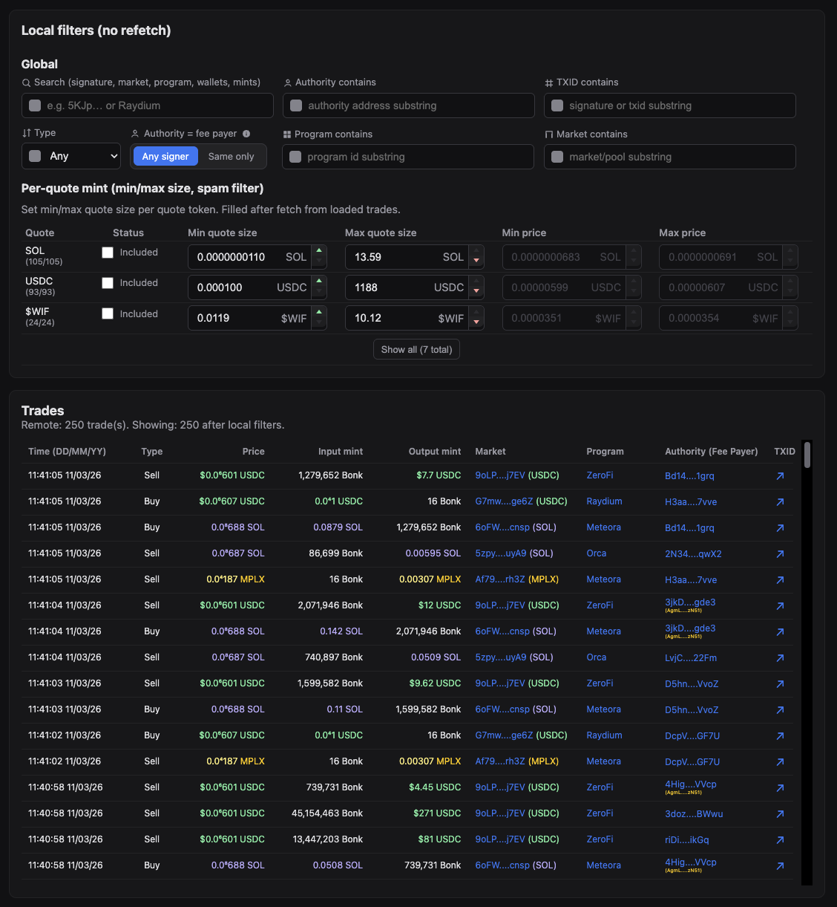
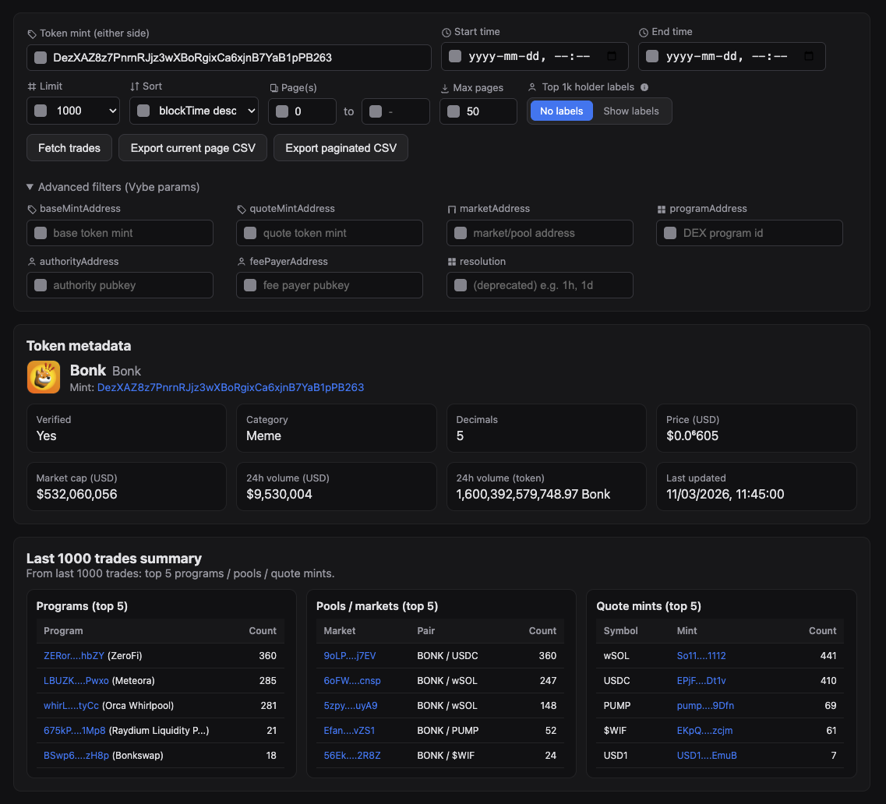
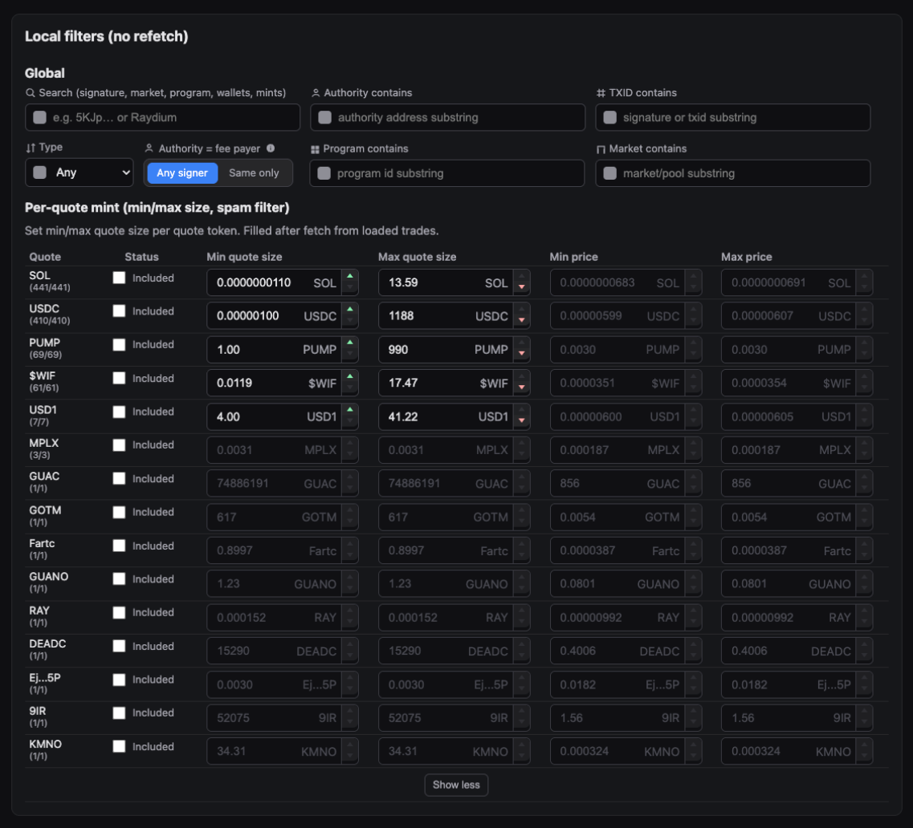
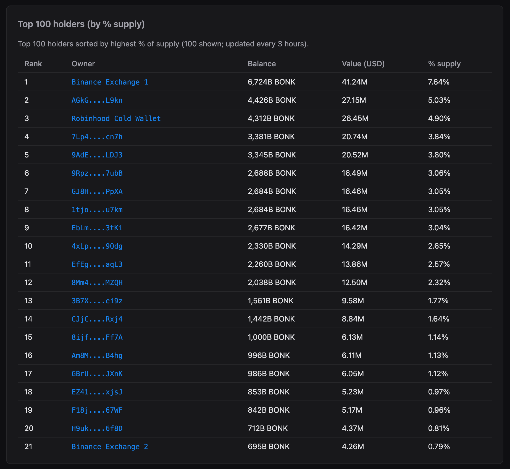

# Solana Historical Trade Data API

This repository demonstrates how to use the Vybe **historical trade data API** to fetch and explore trades for any SPL token, with an in-browser UI for filtering, summarizing, and exporting transactions to CSV.



<p align="center">
  
  
  
</p>

---

**[Get your free Vybe API key →](https://vybenetwork.com/pricing?utm_source=github&utm_medium=repo&utm_campaign=solana-historical-trade-data-api)**  
**[Vybe historical trades docs →](https://docs.vybenetwork.com/reference/get_trade_data_program_v4?utm_source=github&utm_medium=repo&utm_campaign=solana-historical-trade-data-api)**

---

## Prerequisites

- **Node.js** ≥ 20 (LTS recommended)
- **npm** ≥ 10 (or equivalent)

## Quick Start

Get from clone to running app in a few commands:

```bash
git clone https://github.com/vybenetwork/solana-historical-trade-data-api.git
cd solana-historical-trade-data-api
npm install
cp .env.example .env
# Edit .env and set VYBE_API_KEY=your_api_key_here
npm start
```

Then open **http://localhost:3000**, enter a token mint, and click **Fetch trades**.

## Environment Variables

| Variable          | Required | Description                                                                 | Example                                   |
|-------------------|----------|-----------------------------------------------------------------------------|-------------------------------------------|
| `VYBE_API_KEY`    | Yes      | Vybe API key used for all Vybe requests                                     | `your_api_key_here`                       |
| `SOLANA_RPC_URL`  | No       | RPC endpoint for Metaplex symbol lookup (token-symbol fallback for quotes) | `https://api.mainnet-beta.solana.com`    |
| `PORT`            | No       | HTTP server port                                                            | `3000`                                    |
| `TUNNEL`          | No       | Set to `1` to run behind a Cloudflare Tunnel                               | `1`                                       |

Get your API key at `https://vybenetwork.com/pricing`.

---

## What This Repo Provides

- **Historical trades endpoint proxy**
  - Express server that proxies Vybe:
    - `GET /v4/trades`
    - `GET /v4/programs/labeled-program-accounts`
    - `GET /v4/tokens/{mintAddress}`
    - `GET /v4/tokens/{mintAddress}/top-holders`
- **Historical trades web UI**
  - Single-page GUI (no frameworks) built from `src/frontend/app.ts` into `public/app.js`.
  - Lets you explore trade flows for a token, across programs and markets, with Solscan links.
- **Local filters (no refetch)**
  - Search, type filters, authority=fee payer, and substring filters (`market contains`, `program contains`, `signature contains`, `authority contains`, `fee payer contains`).
  - Per-quote mint rules: min/max price, min/max quote size, spam filter, and per-mint exclusions.
- **Per-quote mints table**
  - Dynamically generated table of quote mints with:
    - **Quote** symbol (or `XX...XX` truncated mint when no symbol) matching the UI.
    - **Status** column (`Included` / `Excluded`) with a checkbox to exclude a mint.
    - **Min/Max price** and **Min/Max quote size** inputs (with smart decimal formatting and up/down arrows).
    - **Spam filter** column for a per-mint minimum quote size.
    - Top 3 rows by default with a **Show All (X total)** / **Show top 3** toggle.
- **CSV export**
  - Export **current page** of trades.
  - Export **all pages** (up to a configurable `maxPages`) with built-in retry/backoff.

All of this uses Vybe’s production trade history data across Pump.fun, Raydium, Orca, and other Solana DEXes.

---

## Why Historical Trades Matter

Historical trade data is critical for:

- **Flow analysis**: see which programs, markets, and quote mints actually execute trades for your token.
- **Strategy and execution debugging**: understand slippage, filled size distribution, and where orders route.
- **Spam and wash-trade filtering**: use per-quote size and price rules to cut noise out of your dataset.
- **Monitoring and risk**: watch which venues dominate flow over time.

This repo shows how to build a **practical trade explorer** on top of Vybe’s `/v4/trades` and related endpoints.

---

## Frontend Overview (Historical Trades UI)

The historical trades UI is implemented in `src/frontend/app.ts` and compiled to `public/app.js` via `npm start` (which runs `npm run build:frontend` first).

### Sections

- **Token metadata header**
  - Shows symbol, name, mint, decimals, price, market cap, 24h volume, and holders where available.
  - Falls back to Metaplex/`/api/token-symbol/:mint` when token details fail.
- **Trades summary**
  - Built from the latest fetched trades (no extra Vybe calls):
    - **Top programs**: counts trades by `programAddress` and decorates them with labels from:
      - A well-known program map (Raydium, Orca, Pump.fun, Phoenix, Meteora, Jupiter, etc.).
      - Vybe `GET /v4/programs/labeled-program-accounts` via `GET /api/programs/labeled-program-account`.
    - **Top markets**: counts by `marketAddress` and shows:
      - Market address (Solscan link).
      - Pair (base / most common quote mint in that market).
      - Trade count.
    - **Top quote mints**: counts by `quoteMintAddress` (using symbol lookup and fallbacks).
- **Trades table**
  - One row per trade from `/api/trades`:
    - Timestamp (from `blockTime`), price, base size, quote size.
    - Program, market, base/quote mints, authority, fee payer, signature.
    - Links to Solscan for account and transaction inspection.
  - Supports pagination via `limit`, `pageFrom`, `pageTo`, and `maxPages` controls.
- **Per-quote mints table (local rules)**
  - Built entirely on the client from the **currently loaded, locally filtered trades**.
  - One row per quote mint with:
    - **Quote**: short symbol or truncated mint (`XX...XX` for missing symbols).
    - **Status** column: checkbox with `Included`/`Excluded` label.
    - **Min/Max price** and **Min/Max quote size** inputs, each with:
      - Smart decimal formatting (0 decimals ≥ 100, 2 decimals for 1–100, and more decimals for tiny values).
      - Spinner arrows that respect absolute bounds and a 1-step gap between min and max.
    - **Spam filter**: additional min size filter for that quote mint.
  - Only the **top 3** quote mints are visible initially, with a button to **Show All (X total)** and collapse back.

### Value formatting rules (per-quote table)

- **≥ 100**: show with **0 decimals**.
- **1–100**: show with **2 decimals**.
- **< 1**:
  - Up to 4+ decimals, depending on how many leading zeros are after `0.`.
  - The UI keeps at most the first two non-zero significant digits after leading zeros.
- Spinner arrows adjust the value by the smallest meaningful increment for the current magnitude, not always `1`.

---

## Filters & Workflow

### Remote filters (Vybe query params)

The top of the UI controls the request sent to `/api/trades`:

- **Core fields**
  - `mintAddress` (base or quote mint of interest).
  - `timeStart`, `timeEnd` (Unix seconds).
  - `limit` (trades per page, capped at 1000).
  - `pageFrom`, `pageTo`, and `maxPages` for pagination and export.
  - `sortByAsc` / `sortByDesc` (e.g. `blockTime` or `price`) and `resolution`.
- **Advanced filters**
  - `programAddress`
  - `baseMintAddress`
  - `quoteMintAddress`
  - `marketAddress` (when set, base/quote mints are ignored per API docs).
  - `authorityAddress`
  - `feePayerAddress`

These map directly to `GetTradesParams` in `src/api/trades.ts` and are proxied to Vybe by `GET /api/trades`.

### Local filters (no refetch)

After trades are loaded, local filters apply **in-browser only**:

- **Search**: free-text search across multiple fields.
- **Type filter**: trade type classification based on program/market context.
- **Authority = fee payer**: checkbox to only keep trades where `authorityAddress === feePayerAddress`.
- **Substring filters**: `market contains`, `program contains`, `signature contains`, `authority contains`, `fee payer contains`.

Local filters update:

- The **trades table** contents.
- The **per-quote mints table** aggregates and counts.
- The `(filtered/total)` counts per quote mint.

### Per-quote rules and exclusions

Per-quote rules are stored in `perQuoteRules` and `excludedQuoteMints` in `src/frontend/app.ts`:

- **Min/Max quote size** and **Min/Max price** per quote mint.
- **Spam filter** value to throw away tiny-size trades for that quote.
- **Excluded** checkbox:
  - Keeps the row visible (dimmed) in the per-quote table.
  - Excludes that quote mint from the trades table and per-quote filtered counts.

When you change **remote filters**, the per-quote table:

- Recomputes bounds based on **filtered trades without per-quote rules** (stable rows).
- Keeps the same set/order of top quote mints based on total counts.

---

## CSV Export

The UI exposes two main export actions:

- **Export current page**
  - Uses the current `limit` and `page` values from the UI and saves a CSV of exactly those trades.
- **Export all pages**
  - Walks from `pageFrom` to `pageTo` (or until there are no more trades), up to `maxPages`.
  - Uses retry/backoff for each request (`fetchWithRetry` with up to 5 retries and 2s delay).
  - Streams rows to CSV in the browser and triggers a download.

CSV columns include timestamp, price, base size, quote size, market, program, mints, authority, fee payer, and signature.

---

## Server Proxy Routes

The Express server in `src/server.ts` exposes a small set of routes:

- **`GET /api/trades`**
  - Proxies to Vybe `GET /v4/trades` with query params:
    - `programAddress`, `baseMintAddress`, `quoteMintAddress`, `mintAddress`, `marketAddress`
    - `authorityAddress`, `feePayerAddress`
    - `timeStart`, `timeEnd`
    - `page`, `limit`
    - `sortByAsc`, `sortByDesc`
    - `resolution`
  - Enforces max `limit` of 1000 and ensures only one of `sortByAsc` / `sortByDesc` is set.
- **`GET /api/programs/labeled-program-account?programAddress=…`**
  - Proxies to Vybe `GET /v4/programs/labeled-program-accounts?programAddress=…`.
  - Used by the UI to add human-readable labels for program IDs not in the well-known map.
- **`POST /api/programs/labeled-program-accounts`**
  - Batch variant for multiple program addresses, used with small concurrency to warm labels.
- **`GET /api/tokens/:mint`**
  - Proxies to Vybe `GET /v4/tokens/{mintAddress}` for token stats/metadata.
- **`GET /api/tokens/:mint/top-holders`**
  - Proxies to Vybe `GET /v4/tokens/{mintAddress}/top-holders` and caches results on disk.
- **`GET /api/tokens/:mint/holder-labels`**
  - Uses cached top holders to build wallet labels (e.g. `Top #5` or owner name) for addresses seen in trades.
- **`GET /api/token-symbol/:mint`**
  - Uses Metaplex and/or Vybe token details to resolve a symbol for a mint; cached on disk for reuse.

All Vybe requests are made through a shared client (`src/api/index.ts`) with sensible timeouts and error handling (`toHumanReadableError`).

---

## How to Run

### 1. Clone the repository

```bash
git clone https://github.com/vybenetwork/solana-historical-trade-data-api.git
cd solana-historical-trade-data-api
```

### 2. Install dependencies

```bash
npm install
```

### 3. Set your API key

```bash
cp .env.example .env
# Add your VYBE_API_KEY to .env
```

### 4. Run the server + web app

```bash
npm start
```

Then open **http://localhost:3000**. The UI shows **historical trade data** for a token in a table, with a trades summary, local filters, a per-quote mints table, and **transaction export** to CSV.

### 5. (Optional) Run with Cloudflare Tunnel

To expose the app on a public URL (e.g. for sharing or testing from another device), you can enable a tunnel (requires `cloudflared` installed):

```bash
npm run dev:tunnel
# or
TUNNEL=1 npm start
```

The console will print a **Cloudflare Tunnel URL** (e.g. `https://xxx.trycloudflare.com`).

---

## Project Structure

```text
solana-historical-trade-data-api/
├── .env.example           # Copy to .env, fill in VYBE_API_KEY (and optional SOLANA_RPC_URL, PORT, TUNNEL)
├── .nvmrc                 # Node version (if present)
├── tsconfig.json          # TypeScript config for backend
├── tsconfig.frontend.json # TypeScript config for frontend (builds public/app.js)
├── package.json           # Scripts and pinned dependencies
├── README.md
├── screenshots/           # Screenshots referenced in this README (you update these)
├── public/                # Web GUI (HTML, CSS, built JS)
│   ├── index.html
│   ├── app.js             # Generated by `npm run build:frontend` from src/frontend/app.ts
│   └── app.css
└── src/
    ├── server.ts          # Express server; proxies Vybe API and serves public/
    ├── config.ts          # Env loading, API base URL, timeouts, PUBLIC_DIR
    ├── types/
    │   └── api.ts         # Interfaces matching Vybe API response shapes
    ├── api/
    │   ├── index.ts       # createClient(apiKey) — wires all API methods
    │   ├── client.ts      # Axios wrapper, retries, human-readable errors
    │   ├── tokens.ts      # GET /v4/tokens/{mintAddress}
    │   ├── top-holders.ts # GET /v4/tokens/{mintAddress}/top-holders
    │   ├── trades.ts      # GET /v4/trades, /v4/programs/labeled-program-accounts
    │   └── token-symbol.ts# Token symbol fallback (Metaplex, WSOL/USDC hardcoded)
    ├── cache.ts           # On-disk caches for symbols, programs, holders
    └── frontend/
        └── app.ts         # Historical trades UI (filters, per-quote table, exports) → builds to public/app.js
```

---

## Direct API Usage Example

If you want to bypass the UI and just export trades using Vybe directly:

```typescript
import axios from 'axios';
import fs from 'node:fs';

const API = 'https://api.vybenetwork.xyz';
const headers = { 'X-API-KEY': process.env.VYBE_API_KEY, Accept: 'application/json' };

type Trade = {
  blockTime: number;
  price: string;
  baseSize: string;
  quoteSize: string;
  marketAddress: string;
  signature: string;
};

async function fetchAllTrades(mintAddress: string) {
  let page = 0;
  const limit = 1000;
  const all: Trade[] = [];
  // Use mintAddress as either base or quote mint
  while (true) {
    const { data } = await axios.get<{ data: Trade[] }>(`${API}/v4/trades`, {
      params: { mintAddress, limit, page, sortByDesc: 'blockTime' },
      headers,
    });
    const chunk = data.data || [];
    all.push(...chunk);
    if (chunk.length < limit) break;
    page++;
  }
  return all;
}

const tokenMint = 'DezXAZ8z7PnrnRJjz3wXBoRgixCa6xjnB7YaB1pPB263';

fetchAllTrades(tokenMint).then((trades) => {
  const csv = ['blockTime,price,baseSize,quoteSize,marketAddress,signature']
    .concat(
      trades.map((t) =>
        [t.blockTime, t.price, t.baseSize, t.quoteSize, t.marketAddress, t.signature].join(',')
      )
    )
    .join('\n');
  fs.writeFileSync('trades.csv', csv);
  console.log('Transaction export: %s trades', trades.length);
});
```

Example CSV output:

```csv
blockTime,price,baseSize,quoteSize,marketAddress,signature
1769454000,0.00001234,1000000,123.45,ABC123...,5KJp...
1769454100,0.00001245,500000,61.72,ABC123...,7MNq...
```

---

## Troubleshooting

| Issue                         | What to do |
|-------------------------------|-----------|
| **403 Forbidden**             | Verify `VYBE_API_KEY` in `.env` is correct and has access to the historical trades endpoint. If the key works locally but not on a server, it may be IP-restricted — contact Vybe to allow your server IP. |
| **Slow responses / timeouts** | The app uses a 60s timeout for Vybe requests and retries up to 5 times with a 2s delay. If the API is under load, you may see timeouts; check Vybe status or retry later. |
| **Missing env vars**          | Ensure you copied `.env.example` to `.env` and set `VYBE_API_KEY`. Start the app and look for `VYBE_API_KEY loaded` in the server logs. |

---

## Support

- **Telegram:** [Vybe community](https://t.me/vybenetwork)
- **Support ticket:** [Submit a ticket via vybenetwork.xyz](https://vybenetwork.com)

